# DataVision - Bitcoin vs. Gold Analyse


DataVision ist ein Data-Science-Projekt zur vergleichenden Analyse von Bitcoin (BTC/USD) und Gold (XAU/USD). Das Projekt untersucht Preisentwicklung, Volatilität, technische Indikatoren, statistische Zusammenhänge und Prognosemodelle auf Basis historischer Tagesdaten.

## Inhaltsverzeichnis

- [Projektziel](#projektziel)
- [Aktueller Status](#aktueller-status)
- [Screenshots und Ergebnisse](#screenshots-und-ergebnisse)
- [Features](#features)
- [Tech-Stack](#tech-stack)
- [Installation und lokaler Start](#installation-und-lokaler-start)
- [Nutzung](#nutzung)
- [Tests](#tests)
- [Projektstruktur](#projektstruktur)
- [License](#License)

## Projektziel

Ziel des Projekts ist es, das Marktverhalten von Bitcoin und Gold datenbasiert zu vergleichen. Im Fokus stehen:

- Analyse der Preisentwicklung von BTC/USD und XAU/USD
- Vergleich der Volatilität beider Anlageklassen
- Untersuchung technischer Indikatoren wie RSI, MACD und gleitender Durchschnitte
- Bewertung statistischer Zusammenhänge mit Hypothesentests
- Modellierung von Marktphasen und Preisprognosen
- Visualisierung zentraler Muster, Ausreißer und Korrelationen

Die Analyse orientiert sich am CRISP-DM-Prozess mit den Phasen Business Understanding, Data Understanding, Data Preparation, Modeling, Evaluation und Deployment.

## Aktueller Status

| Bereich | Status |
| --- | --- |
| Datenanalyse | Abgeschlossen |
| Datenbereinigung | Abgeschlossen |
| Technische Indikatoren | Abgeschlossen |
| Visualisierungen | Abgeschlossen |
| Hypothesentests | Abgeschlossen |
| Regression und Klassifikation | Abgeschlossen |
| Prophet-Prognose | Abgeschlossen |
| Automatisierte Tests | Nicht dokumentiert |

Die wichtigsten Ergebnisse zeigen, dass Bitcoin im Vergleich zu Gold deutlich stärkere Preisschwankungen aufweist. Gold zeigt stabilere Preiscluster, während Bitcoin durch hohe Streuung, starke Ausreißer und dynamischere Trendbewegungen geprägt ist.

## Screenshots und Ergebnisse

Die folgenden Abbildungen wurden aus der Projektdokumentation extrahiert und im Ordner `docs/screenshots` abgelegt.

### 1. Schlusskurse von Bitcoin und Gold

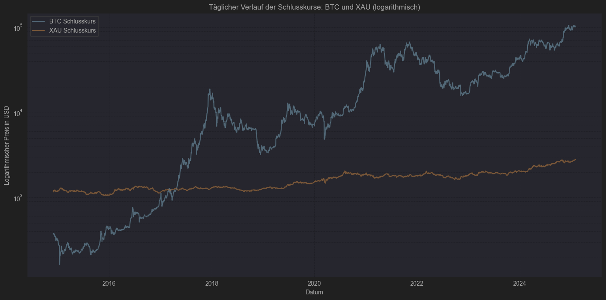

Der logarithmische Kursverlauf zeigt die langfristige Entwicklung beider Anlageklassen. Bitcoin weist deutlich stärkere Wachstums- und Korrekturphasen auf, während Gold stabiler verläuft.

### 2. Histogramme der Preise und technischen Indikatoren

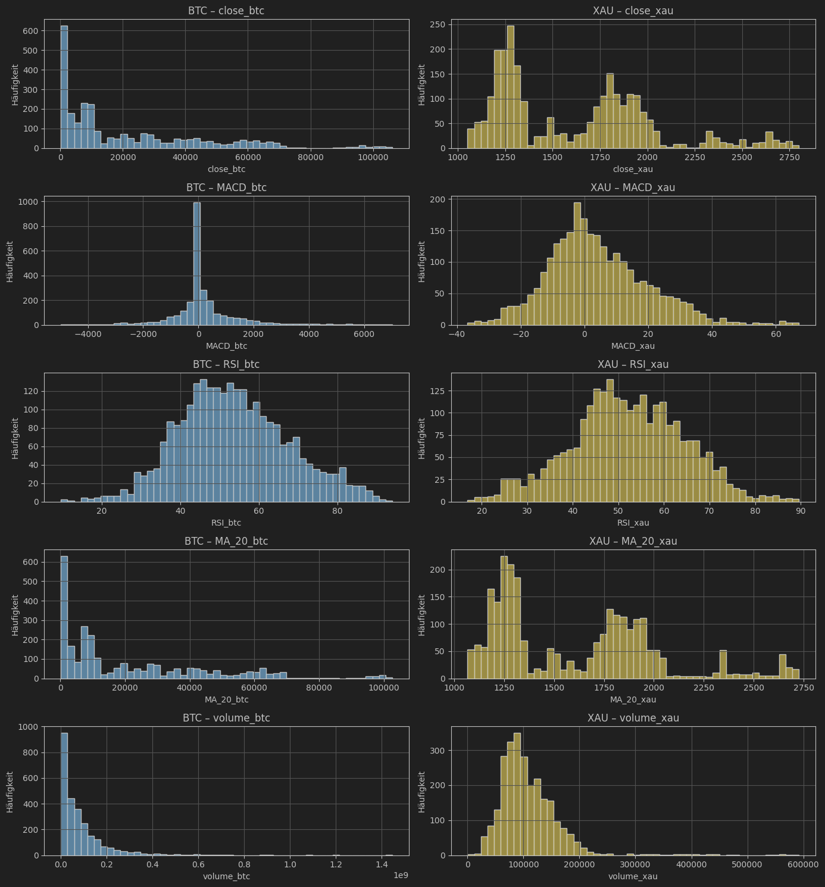

Die Verteilungen zeigen große Unterschiede zwischen BTC und XAU. Bitcoin besitzt breitere Streuungen und stärkere Ausreißer, während Gold klarere Preisbereiche und stabilere technische Werte zeigt.

### 3. BTC-Schlusskurs vs. XAU-Schlusskurs

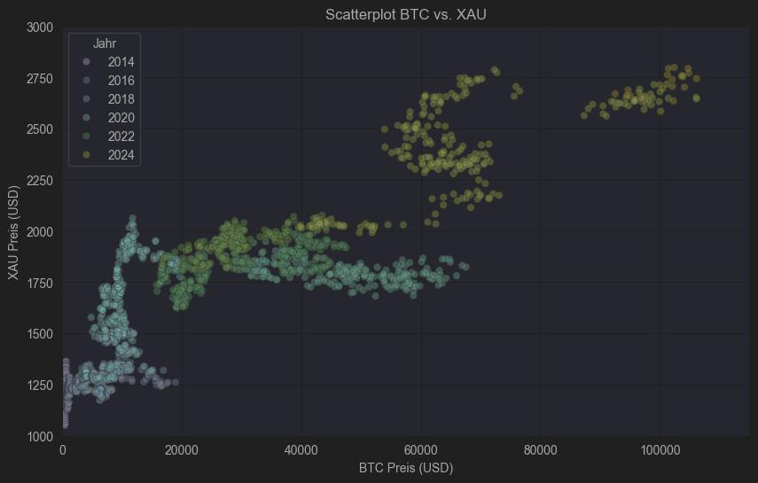

Das Streudiagramm visualisiert den Zusammenhang zwischen Bitcoin- und Goldpreisen über verschiedene Jahre. Es zeigt zeitliche Cluster und eine erkennbare langfristige Mitbewegung.

### 4. Technische Indikatoren und Handelsvolumen

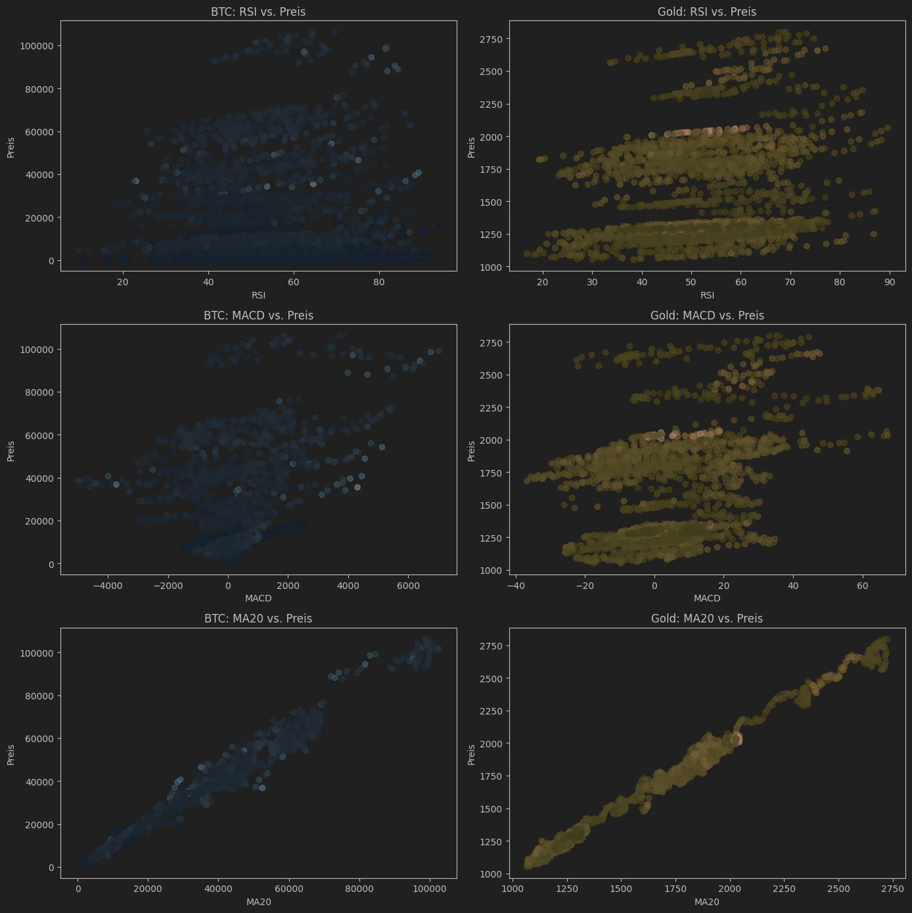

Die Streudiagramme vergleichen RSI, MACD und MA20 mit den jeweiligen Preisen. Besonders der gleitende Durchschnitt zeigt einen starken Zusammenhang mit dem Preisverlauf.

### 5. Tägliche Renditen

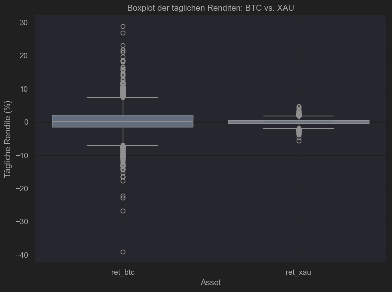

Der Boxplot macht sichtbar, dass Bitcoin deutlich größere Renditeschwankungen und mehr Ausreißer besitzt als Gold.

### 6. Hexagonales Binning der Renditen

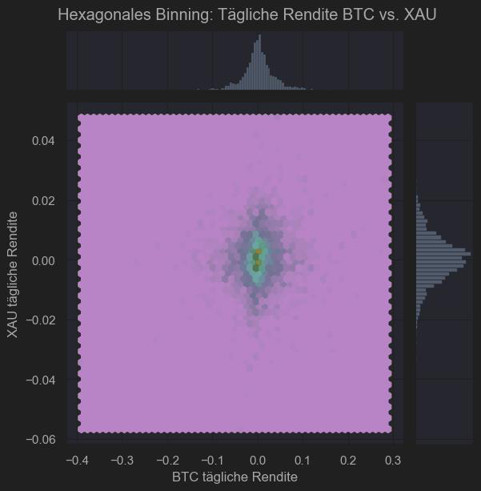

Das Hexbin-Diagramm zeigt die gemeinsame Verteilung der täglichen Renditen. Die meisten Beobachtungen liegen nahe null, einzelne extreme BTC-Bewegungen treten jedoch stärker hervor.

### 7. Korrelation der Schlusskurse

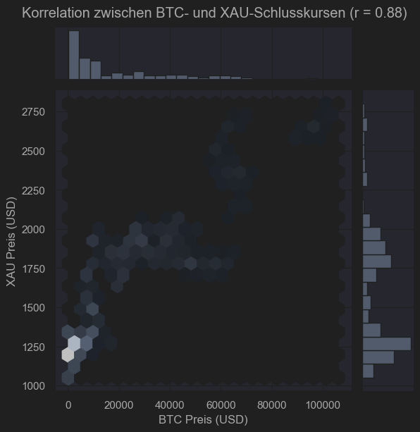

Die Darstellung zeigt eine positive Korrelation zwischen den Schlusskursen von BTC und XAU. Der Zusammenhang ist sichtbar, aber durch unterschiedliche Dynamiken beider Märkte geprägt.

### 8. Korrelationsmatrix

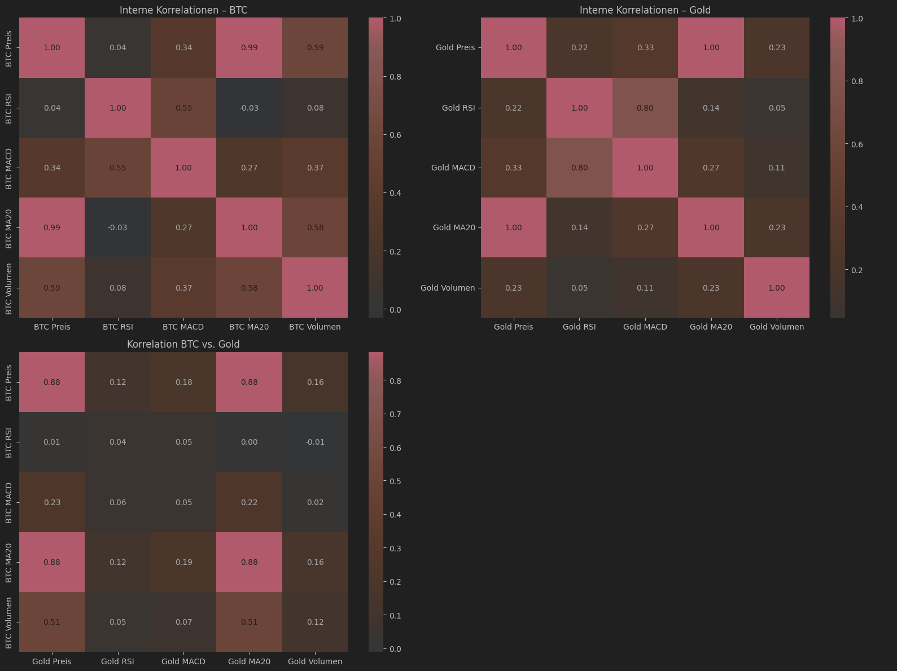

Die Heatmaps zeigen interne Korrelationen innerhalb beider Assets sowie Cross-Korrelationen zwischen Bitcoin- und Goldvariablen. Preisnahe Indikatoren korrelieren erwartungsgemäß besonders stark mit den Schlusskursen.

### 9. Gemeinsame Kursbewegungen

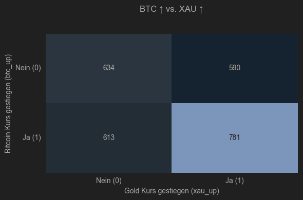

Die Kontingenztabelle zeigt, wie häufig Bitcoin und Gold gemeinsam steigen oder fallen. Daraus lässt sich ein statistischer Zusammenhang im Up/Down-Verhalten ableiten.

### 10. Preisbereiche von BTC und XAU

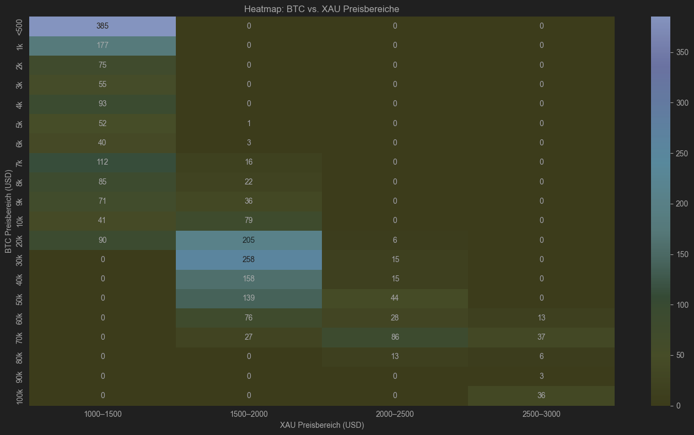

Die Heatmap gruppiert Preisbereiche beider Assets und zeigt, welche Kombinationen historisch besonders häufig gemeinsam aufgetreten sind.

### 11. Volatilität von BTC und XAU

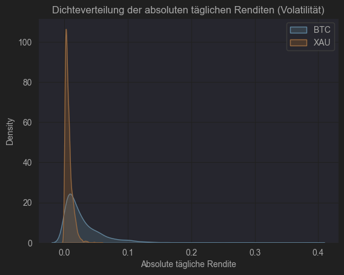

Die Dichteverteilung der absoluten Renditen bestätigt, dass Bitcoin volatiler ist als Gold. Die Verteilung von BTC ist breiter und besitzt stärkere Ausschläge.

### 12. Zwei-Weg-ANOVA

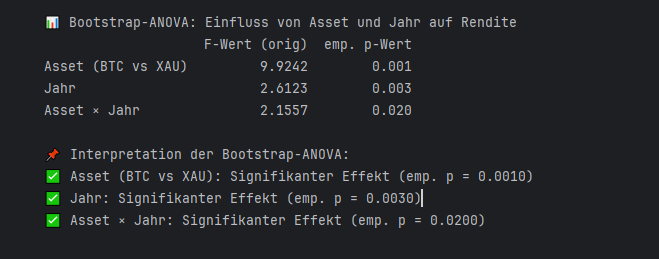

Die ANOVA untersucht, ob Asset-Typ und Jahr einen signifikanten Einfluss auf die Rendite haben. Die Ergebnisse zeigen signifikante Effekte für Asset und Jahr.

### 13. Monats-ANOVA mit Bootstrap

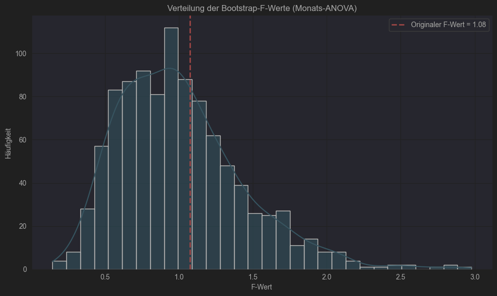

Die Bootstrap-Verteilung der F-Werte bewertet, ob sich durchschnittliche BTC-Monatsrenditen signifikant unterscheiden. Das Ergebnis zeigt keinen starken Monatsunterschied.

### 14. BTC-Preis nach Gold-Handelsvolumen

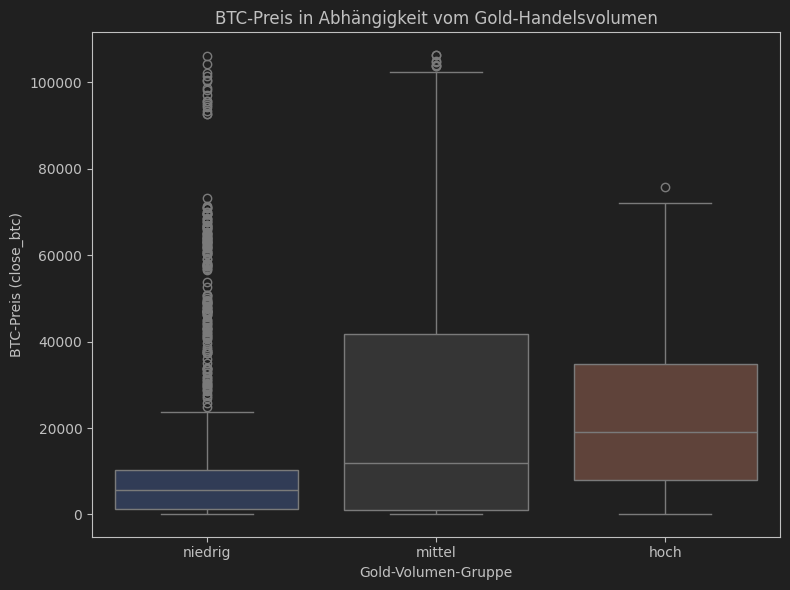

Die Gruppierung nach Gold-Handelsvolumen zeigt deutliche Unterschiede im BTC-Preis zwischen niedrigen, mittleren und hohen Volumengruppen.

### 15. Chi-Quadrat-Test

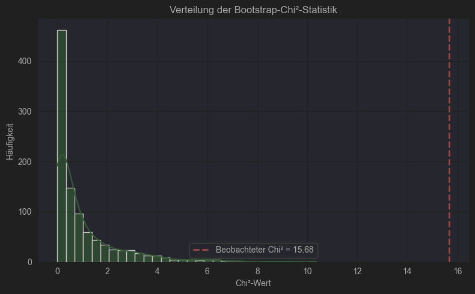

Der Chi-Quadrat-Test prüft den Zusammenhang zwischen BTC- und XAU-Kursbewegungen. Die beobachtete Statistik liegt deutlich außerhalb der typischen Bootstrap-Verteilung.

### 16. Multiple lineare Regression

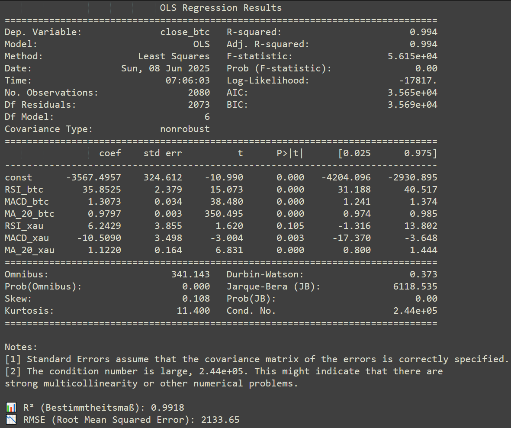

Die Regression nutzt technische Indikatoren von BTC und XAU, um den BTC-Schlusskurs zu erklären. Das Modell erreicht eine hohe Anpassungsgüte.

### 17. Vergleich tatsächlicher und vorhergesagter BTC-Preise

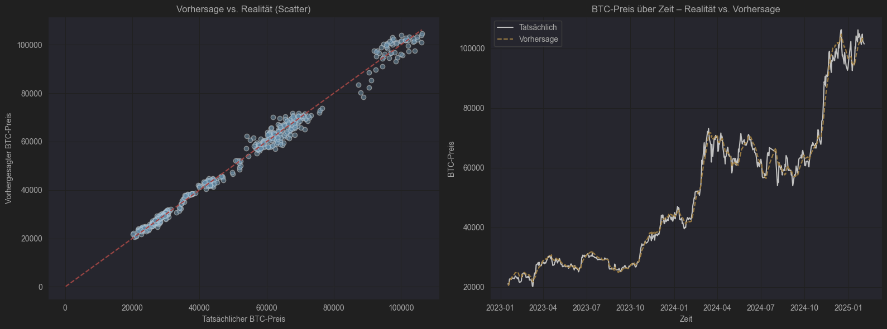

Der Vergleich zeigt, dass die Regression den tatsächlichen BTC-Preisverlauf weitgehend nachvollzieht. Abweichungen werden vor allem in dynamischen Marktphasen sichtbar.

### 18. Klassifikation mit Naive Bayes und LDA

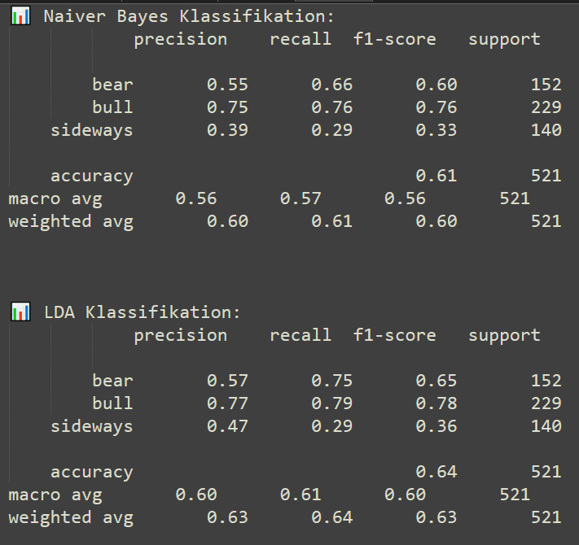

Die Klassifikation ordnet Marktphasen in `bull`, `bear` und `sideways` ein. LDA erzielt im Vergleich zu Naive Bayes eine etwas höhere Gesamtgenauigkeit.

### 19. Prophet-Prognose für Bitcoin und Gold

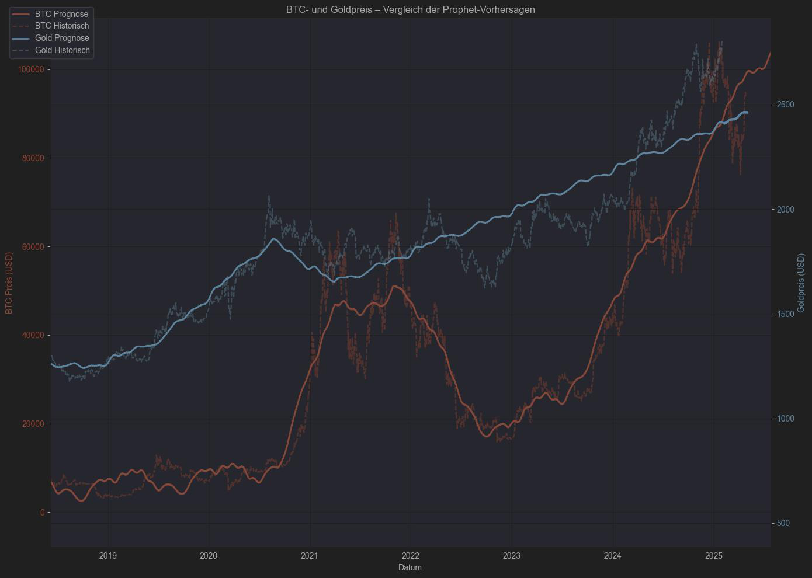

Die Prophet-Prognose zeigt historische und prognostizierte Werte für BTC und Gold. Beide Zeitreihen werden gemeinsam visualisiert, um Trends und erwartete Entwicklungen vergleichbar zu machen.

## Features

- Einlesen und Bereinigen historischer BTC- und XAU-Tagesdaten
- Standardisierung von Spaltennamen und Datumsformaten
- Berechnung technischer Indikatoren:
    - RSI
    - MACD
    - gleitender Durchschnitt über 20 Tage
    - Trendlinienindikator
- Zusammenführung beider Datensätze über gemeinsame Tagesdaten
- Deskriptive Statistik mit Konfidenzintervallen
- Visualisierung von Kursverläufen, Renditen, Korrelationen und Preisbereichen
- Hypothesentests mit Bootstrap-Sampling
- Multiple lineare Regression zur Preisprognose
- Klassifikation von Marktphasen mit Naive Bayes und LDA
- Zeitreihenprognose mit Prophet

## Tech-Stack

| Kategorie | Technologien |
| --- | --- |
| Sprache | Python |
| Analyse | Pandas, NumPy |
| Visualisierung | Matplotlib, Seaborn |
| Statistik | SciPy, Statsmodels |
| Machine Learning | Scikit-learn |
| Forecasting | Prophet |
| Umgebung | Jupyter Notebook |
| Datenformat | CSV |

## Installation und lokaler Start

```bash
git clone https://github.com/mohammadtaiba/DataVision
cd DataVision
```

```bash
python -m venv .venv
source .venv/bin/activate
```

Für Windows PowerShell:

```powershell
python -m venv .venv
.\.venv\Scripts\Activate.ps1
```

Abhängigkeiten installieren:

```bash
pip install -r requirements.txt
```

Jupyter Notebook starten:

```bash
jupyter notebook
```

## Nutzung

Die Analyse erwartet historische Tagesdaten für Bitcoin und Gold. Die im Projekt verwendeten Dateien sind:

```text
BTCUSD_1d_analysis.csv
XAUUSD_1d_analysis.csv
```

Beispiel zum Laden des finalen Datensatzes:

```python
import pandas as pd

final_dataset = pd.read_csv("data/final_merged_dataset.csv", parse_dates=["date"])
print(final_dataset.head())
```

Beispiel für eine einfache Renditeberechnung:

```python
final_dataset["ret_btc"] = final_dataset["close_btc"].pct_change()
final_dataset["ret_xau"] = final_dataset["close_xau"].pct_change()
```

## Tests

Automatisierte Tests sind aktuell nicht dokumentiert. Für eine reproduzierbare Prüfung sollte das Notebook vollständig ausgeführt werden:

```bash
jupyter notebook
```

Empfohlene manuelle Prüfungen:

- Alle Datenquellen lassen sich ohne Fehler laden.
- Der finale zusammengeführte Datensatz enthält keine fehlenden Kernwerte.
- Alle Visualisierungen werden erzeugt.
- Alle Modell- und Testzellen laufen ohne Fehler durch.

## Projektstruktur

Aktuelle Struktur des Repositorys:

```text
.
├── data-vision-site/  # MkDocs-Seite mit aufbereiteten Projektdokumenten
├── dataset/           # Eingabe- und Ausgabedaten der Analyse
├── docs/              # Screenshots und ergänzende Dokumentation
├── notebooks/         # Jupyter-Notebooks für Datenanalyse und Visualisierung
├── .gitignore         # Git-Ignorierregeln für lokale und generierte Dateien
├── LICENSE            # Lizenzinformationen
├── README.md          # Projektübersicht und Einstiegspunkt
└── requirements.txt   # Python-Abhängigkeiten für den lokalen Start
```

## License

Copyright (c) 2026 Mohammad Taiba. All rights reserved.

This project is published for portfolio and review purposes only. See [LICENSE](./LICENSE).
